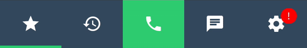
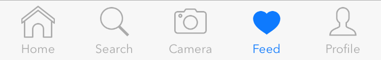
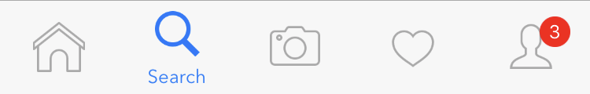

A custom tab bar controller for iOS written in Swift 4.0

## Screenshots



## Installation


### Cocoa Pods:

```bash
pod 'AZTabBar'
```

### Manual:

Simply drag and drop the ```Sources``` folder to your project.

## Usage:

Create an array of String/UIImage:
```swift
//The icons that will be displayed on the tabs that are not currently selected
var icons = [String]()
icons.append("ic_star_outline")
icons.append("ic_history_outline")
icons.append("ic_phone_outline")
icons.append("ic_chat_outline")
icons.append("ic_settings_outline")

//The icons that will be displayed for each tab once they are selected.
var selectedIcons = [String]()
selectedIcons.append("ic_star_filled")
selectedIcons.append("ic_history_filled")
selectedIcons.append("ic_phone_filled")
selectedIcons.append("ic_chat_filled")
selectedIcons.append("ic_settings_filled")
```

Now initialize the controller object through the following method:
```swift
tabController = .insert(into: self, withTabIconNames: icons, andSelectedIconNames: selectedIcons)
```

Add controllers:
```swift
//if you are using storyboard:
let myChildViewController = UIStoryboard(name: "Main", bundle: nil).instantiateViewController(withIdentifier: "ChildViewController")!

//if you are loading programmatically:
let myChildViewController = ChildViewController()

tabController.setViewController(myChildViewController, atIndex: 0)
```

Add actions:
```swift
tabController.setAction(atIndex: 3) { 
    //Your statments
    print("Hello World")
}
```

Note that you can add both actions and view controllers at a certain index.

## Customizations:

```swift
//default color of the icons on the buttons
tabController.defaultColor = .white 

//the color of the icon when a menu is selected
tabController.selectedColor = .orange 

//The color of the icon of a highlighted tab
tabController.highlightColor = .white

//The background color of the button of the highlighted tabs.
tabController.highlightedBackgroundColor = .green

//The background color of the tab bar
tabController.buttonsBackgroundColor = .black 

//The color of the selection indicator.
tabController.selectionIndicatorColor = .green

// default is 3.0
tabController.selectionIndicatorHeight = 0 

// change the seperator line color
tabController.separatorLineColor = .black 

//hide or show the seperator line
tabController.separatorLineVisible = false 

//Enable tab change animation that looks like facebook
tabController.animateTabChange = true
```

## Extras:

Make tab look highlighted:
```swift
tabController.highlightButton(atIndex: 2) 
```

Hide/Show the tab bar:
```swift
tabController.setBar(hidden: true, animated: true)
```

Add badge to menu (use nil value to remove existing badges): 
```swift
tabController.setBadgeText("5", atIndex: 3)
```

Switch programmatically to a certain tab: 
```swift
tabController.setIndex(2) //animated = true by default
//or
tabController.setIndex(2, animated: false)
```

Grant access to change the status bar style per tab:
```swift
override var childViewControllerForStatusBarStyle: UIViewController?{
    return tabController
}
```

```swift
//Then implement the delegate method:
func tabBar(_ tabBar: AZTabBarController, statusBarStyleForIndex index: Int) -> UIStatusBarStyle {
    return (index % 2) == 0 ? .default : .lightContent
}
```

## Manage Titles

### Adding Titles:

```swift
tabController.setTitle("Home", atIndex: 0)
tabController.setTitle("Search", atIndex: 1)
tabController.setTitle("Camera", atIndex: 2)
tabController.setTitle("Feed", atIndex: 3)
tabController.setTitle("Profile", atIndex: 4)
```




### Show Title Only For Selected Index:

```swift
tabController.onlyShowTextForSelectedButtons = true
```



## Access AZTabBarController from child view controllers:

I created an extension for `UIViewController` which adds a var called `currentTabBar`:
```swift
public var currentTabBar: AZTabBarController? { get }
```

You can call it like this:
```swift
currentTabBar?.setBadgeText("New Badge Value",atIndex: 2)
```


## Delegate Methods:

These are the functions of the AZTabBarDelegate:

```swift
/// This function is called after `didMoveToTabAtIndex` is called. In order for this function to work you must override the var `childViewControllerForStatusBarStyle` in the root controller to return this instance of AZTabBarController.
///
/// - Parameters:
///   - tabBar: The current instance of AZTabBarController.
///   - index: The index of the child view controller which you wish to set a status bar style for.
/// - Returns: The status bar style.
func tabBar(_ tabBar: AZTabBarController, statusBarStyleForIndex index: Int)-> UIStatusBarStyle
```

```swift
/// This function is called whenever user clicks the menu a long click. If returned false, the action will be ignored.
///
/// - Parameters:
///   - tabBar: The current instance of AZTabBarController.
///   - index: The index of the child view controller which you wish to disable the long menu click for.
/// - Returns: true if you wish to allow long-click interaction for a specific tab, false otherwise.
func tabBar(_ tabBar: AZTabBarController, shouldLongClickForIndex index: Int)-> Bool
```

```swift
/// This function is used to enable/disable animation for a certian tab.
///
/// - Parameters:
///   - tabBar: The current instance of AZTabBarController.
///   - index: The index of the tab.
/// - Returns: true if you wish to enable the animation, false otherwise.
func tabBar(_ tabBar: AZTabBarController, shouldAnimateButtonInteractionAtIndex index:Int)->Bool
```

```swift
/// This function is called whenever user taps one of the menu buttons.
///
/// - Parameters:
///   - tabBar: The current instance of AZTabBarController.
///   - index: The index of the menu the user tapped.
func tabBar(_ tabBar: AZTabBarController, didSelectTabAtIndex index: Int)
```

```swift
/// This function is called whenever user taps and hold one of the menu buttons. Note that this function will not be called for a certain index if `shouldLongClickForIndex` is implemented and returns false for that very same index.
///
/// - Parameters:
///   - tabBar: The current instance of AZTabBarController.
///   - index: The index of the menu the user long clicked.
func tabBar(_ tabBar: AZTabBarController, didLongClickTabAtIndex index:Int)
```

```swift
/// This function is called before the child view controllers are switched.
///
/// - Parameters:
///   - tabBar: The current instance of AZTabBarController.
///   - index: The index of the controller which the tab bar will be switching to.
func tabBar(_ tabBar: AZTabBarController, willMoveToTabAtIndex index:Int)
```

```swift
/// This function is called after the child view controllers are switched.
///
/// - Parameters:
///   - tabBar: The current instance of AZTabBarController.
///   - index: The index of the controller which the tab bar had switched to.
func tabBar(_ tabBar: AZTabBarController, didMoveToTabAtIndex index: Int)
```

## Credits

AZTabBarController was originally inspired by [ESTabBarController](https://github.com/ezescaruli/ESTabBarController) that is written in Objective-C by [ezescaruli](https://github.com/ezescaruli).

Thanks to [Tobaloidee](https://github.com/Tobaloidee) for creating the logo.


