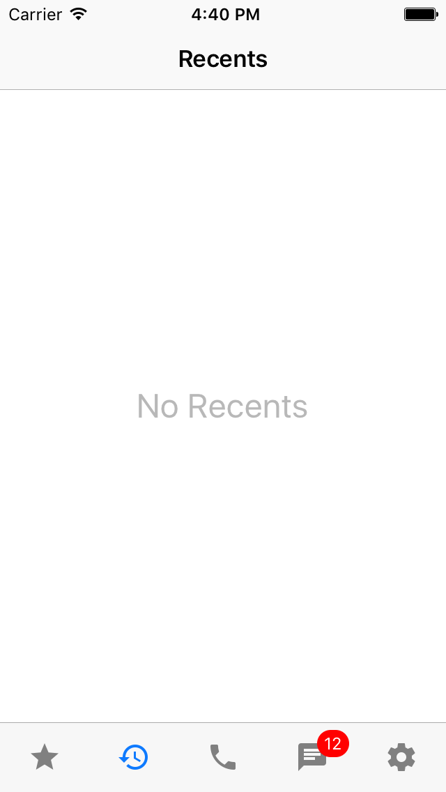

# AZTabBarController
A custom tab bar controller for iOS written in Swift 3.0

##Screenshots



##Installation

###Manual:

Simply drag and drop the ```Sources``` folder to your project.

###Cocoa Pods:

Will be added soon.


##Usage

Create an array of String/UIImage:
```swift
var icons = [String]()
icons.append("ic_star")
icons.append("ic_history")
icons.append("ic_phone")
icons.append("ic_chat")
icons.append("ic_settings")
```

Now initialize the controller object through the following methods:
```swift
    let tabController = AZTabBarController.insert(into: self, withTabIconNames: icons)
```

Or the old fashion way:
```swift
    let tabController = AZTabBarController(withTabIconNames: icons)
    self.addChildViewController(controller)
    self.view.addSubview(controller.view)
    tabController.view.frame = parent.view.bounds
    tabController.didMove(toParentViewController: parent)
```

Add optional controllers:
```swift
    tabController.set(viewController: myChildViewController, atIndex: 0)
    tabController.set(viewController: myOtherChildViewController, atIndex: 1)
    tabController.set(viewController: settingsController, atIndex: 2)
```

Add optional actions:
```swift
    tabController.set(action: { 

        //Your statments
        print("Hello World")

    }, atIndex: 3)
```

Note that you can add both actions and view controllers at a certain index.

##Customizations

```swift

    tabController.defaultColor = UIColor.white //default color of the icons on the buttons
        
    tabController.selectedColor = UIColor.orange //the color of the icon when a menu is selected
        
    tabController.buttonsBackgroundColor = UIColor.black //The background color of the tab bar in a nutshell

    tabController.selectionIndicatorHeight = 0 // default is 3.0

    tabController.highlightButton(atIndex: 2) //make this button look highlighted.

    tabController.separatorLineColor = UIColor.black // change the seperator line color (I recommened to leave this untouched or simply hide the seperator)

    tabController.separatorLineVisible = false //hide or show the seperator line
```

##Extras


Hide/Show the tab bar:
```swift
     tabController.setBar(hidden: true, animated: true)
```

Add badge to menu (use nil value to remove existing badges): 
```swift
    tabController.set(badge: "5", atIndex: 3)
```

switch programmatically to a certain tab: 
```swift
    tabController.set(selectedIndex: 2, animated: true)
```

##Credit

AZTabBarController is a converted and modified version of [ESTabBarController](https://github.com/ezescaruli/ESTabBarController) that is written in Objective-C by [ezescaruli](https://github.com/ezescaruli).


